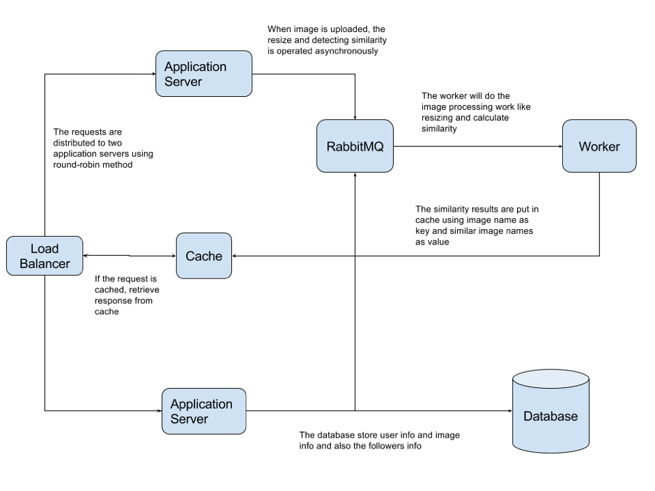

## Introduction

This repository contains the source code for scalable image web service.

## Components

1. Two application servers (Flask running on Gunicorn application server)
2. One database server (MySQL)
3. Load balancer (Nginx)
4. Cache (Redis)
5. Message Queue (RabbitMQ)
6. Process Control (Supervisor)

**Scalability:**

1. Using load balancer to distribute work load to different application servers, more application servers can be used to handle more work load
2.	Using load balancer to distribute work load to different application servers, more application servers can be used to handle more work load
3. Using message queue to offload the work of image resizing and detecting similar images to workers, so the work is conducted out of http request-response cycle, more workers can be set up to handle more work load
4. Using message queue to offload the work of image resizing and detecting similar images to workers, so the work is conducted out of http request-response cycle, more workers can be set up to handle more work load



